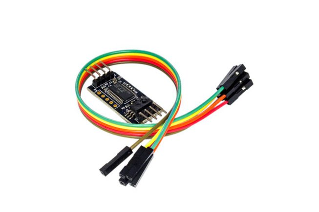
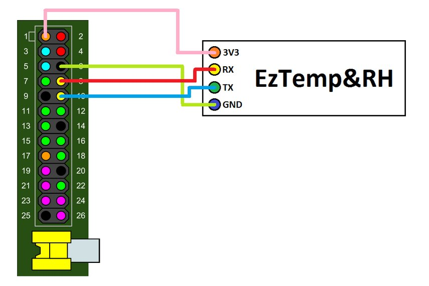

# EzTemp & RH sensor by CAIMANICS

___Note__: this is an crude backup repository of instructions to use __CAIMANICS EzTempRH__ humidity and temperature sensor since they have apparently vanished off of the face of the Internet. Original content by Eloísa Romero & Pablo Bacho_

_At the time of writing, the [original Instructables](https://www.instructables.com/id/Easy-Temperature-and-Humidity-on-Raspberry-Pi/) is still available, but not the Github project repository (there is still a [CAIMANICS github repo](https://github.com/CAIMANICS/) but it only show two unrelated projects, and no recent activity)._

_So here is my take on trying to salvage some information (as I own one board and I am using it)._

## EzTemp & RH sensor is a small board once manufactured by a Spanish company called CAIMANICS which featured a professional temperature & relative humidity sensor

### Features

EzTemp features a professional-grade Honeywell HIH5030, 3% accurate from 11-89% RH (7% at 0-10% and 90-100%), as well as a 10kOhm 1% thermistor. Sensors are read by a precision 12-bit SAR ADC. You can also connect an external sensor to the ADC to use it on Raspberry Pi.



1. Initial setup on the Raspberry

    By default, the Raspberry Pi uses the serial port for the shell. We need to disable the serial console to use the EzTemp.

    * __Method 1__: raspi-config script

        The easiest way to disable the serial console is by running the raspi-config script. Open a shell and type:

        ```sudo raspi-config```
        
        It will show a menu, just go to 8 Advanced Options > A7 Serialand select No.

        Now reboot the Pi and go to the next step.

    * __Method 2__: Automatic script

        We can disable and enable the serial console using the rpi-serial-console script. To install it, open the shell and type:

        ```sudo wget https://raw.githubusercontent.com/lurch/rpi-serial-console/master/rpi-serial-console -O /usr/bin/rpi-serial-console && sudo chmod +x /usr/bin/rpi-serial-console```

        To display whether the serial console is currently enabled or not, simply run:

        ```rpi-serial-console status```

        To disable the serial console, simply run:

        ```sudo rpi-serial-console disable```

        To enable the serial console, simply run:

        ```sudo rpi-serial-console enable```

        After enabling or disabling the serial console you'll need to reboot the Pi for it to take effect, and go to the next step.

    * __Method 3__: Manual

        Open this file with your favorite editor:

        ```sudo nano /boot/cmdline.txt```

        Its content should be something like this:

        ```dwc_otg.lpm_enable=0 console=tty1 console=ttyAMA0,115200 root=/dev/mmcblk0p2 rootfstype=ext4 elevator=deadline rootwait```

        Remove any reference to ttyAMA0, getting something like this:

        ```dwc_otg.lpm_enable=0 console=tty1 root=/dev/mmcblk0p2 rootfstype=ext4 elevator=deadline rootwait```

        Save changes, and open inittab:

        ```sudo nano /etc/inittab```

        At the end of the file, comment out this line:

        ```T0:23:respawn:/sbin/getty -L ttyAMA0 115200 vt100```

        Reboot your Pi and go to the next step.

1. Connection

    EzTemp uses the serial port on your Raspberry Pi to communicate.

    Identify the serial pins on your Raspberry Pi. Then connect:

    * RPi GND to EzTemp GND.

    * RPi Tx to EzTemp Rx.

    * RPi Rx to EzTemp Tx.

    * RPi 3.3V to EzTemp 3.3V.

    Notice that a Tx pin must be connected to a Rx pin, and vice-versa.

    This is how the sensor should be plugged on the the Raspberry GPIO (here only the first 26 pins shown):
    

1. Sample Python script

    ```python
    import serial

    ser = serial.Serial('/dev/ttyAMA0', 9600, timeout=1)

    ser.write("v")
    s = ser.read(4)
    version = (ord(s[1]) << 8) + ord(s[2])
    print 'EzTemp&RH build ' + str(version)

    ser.write("d")
    s = ser.read(4)
    temperature = (ord(s[1]) << 8) + ord(s[2])
    print 'Temperature: ' + str(1.0*temperature/10) + 'C'

    ser.write("i")
    s = ser.read(4)
    humidity = (ord(s[1]) << 8) + ord(s[2])
    print 'Humidity:    ' + str(1.0*humidity/10) + '%'

    ser.write("x")
    s = ser.read(4)
    external = (ord(s[1]) << 8) + ord(s[2])
    print 'External:    ' + str(external) + ' / 2048 counts'

    ser.write("v")
    s = ser.read(4)
    version = (ord(s[1]) << 8) + ord(s[2])
    print 'Version:     ' + str(version)

    ser.close()
    ```

    Download [raw script from Github](https://github.com/mrouillard/EZTempRH/raw/master/EzTempRH.py).

    Tested with Python 2 only at the time of writing.

1. Other references

    A nice article in French on [Framboise314](https://www.framboise314.fr/carte-dextension-humiditetemperature-pour-le-raspberry-pi/)